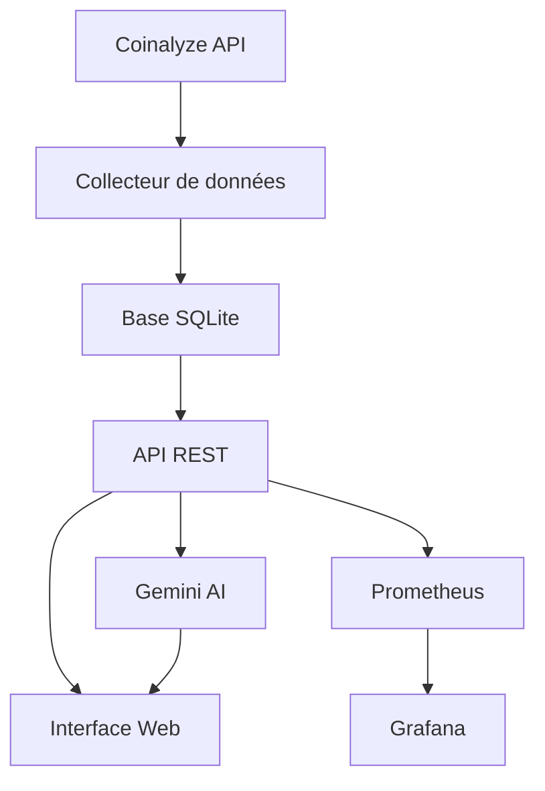
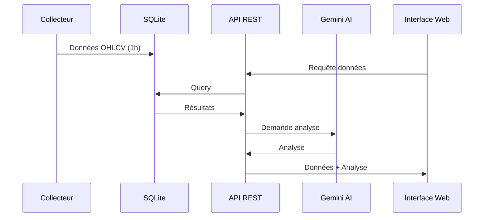
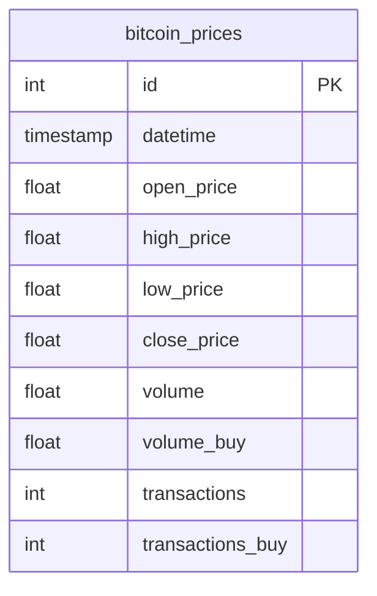

# Suivi du Projet : Analyse des Tendances du Bitcoin avec IA & Open Data

## 📋 Description du Projet
Développement d'une solution d'analyse des tendances du Bitcoin utilisant l'intelligence artificielle et les données ouvertes, avec une API REST et une interface web.

## 🔑 Informations Clés
- **Environnement** : Windows 10
- **Python** : 3.9+
- **Base de données** : SQLite
- **API Externes** :
  - Coinalyze API (données Bitcoin)
  - Google Gemini Pro (analyse IA)
- **Framework** :
  - Backend : FastAPI
  - Frontend : Streamlit
  - ORM : SQLAlchemy

## 🛠️ Installation et Configuration
### Variables d'environnement (.env)
```
COINALYZE_API_KEY=votre_clé_ici
GEMINI_API_KEY=votre_clé_ici
LOG_LEVEL=INFO
```

### Dépendances principales (requirements.txt)
```
fastapi==0.109.2
uvicorn==0.27.1
streamlit==1.31.0
plotly==5.18.0
google-generativeai==0.3.2
python-dotenv==1.0.1
```

### Structure de la base de données
```sql
CREATE TABLE bitcoin_prices (
    id INTEGER PRIMARY KEY AUTOINCREMENT,
    timestamp TIMESTAMP NOT NULL,
    open_price REAL NOT NULL,
    high_price REAL NOT NULL,
    low_price REAL NOT NULL,
    close_price REAL NOT NULL,
    volume REAL,
    volume_buy REAL,
    transactions INTEGER,
    transactions_buy INTEGER,
    UNIQUE(timestamp)
);
```

## 📅 Date de mise à jour : 20/02/2025

## 📊 État d'Avancement Global
- Phase 0 : 🟢 Terminé (100%)
  - ✅ Méthode agile mise en place
  - ✅ Backlog créé
  - ✅ Suivi projet initialisé
- Phase 1 : 🟢 Terminé (100%)
  - ✅ Conception réalisée
  - ✅ Modélisation des données
  - ✅ Spécifications fonctionnelles
- Phase 2 : 🟢 Terminé (100%)
  - ✅ Collecte des données
  - ✅ Base de données
  - ✅ API de données
- Phase 3 : 🟡 En cours (80%)
  - ✅ Migration vers Gemini
  - ✅ Intégration OpenAI pour l'analyse
  - ❌ Tests et validation de l'analyse IA à finaliser
- Phase 4 : 🟡 En cours (70%)
  - ✅ API REST de base
  - ❌ Tests unitaires à compléter
  - ❌ Documentation API à finaliser
- Phase 5 : 🟡 En cours (60%)
  - ✅ Structure de l'application
  - ❌ Interface utilisateur à optimiser
  - ❌ Tests utilisateurs à réaliser
  - ❌ Optimisations à faire
- Phase 6 : 🔴 À commencer (20%)
  - ✅ Système de logging basique
  - ❌ Monitoring à implémenter
  - ❌ Documentation à compléter

## 🔄 Dernières Actions (20/02/2025)
1. Amélioration de l'interface graphique :
   - Correction de l'affichage 24h
   - Optimisation des graphiques
   - Ajout de grilles et repères
2. Documentation complète :
   - Création de documentation_projet.md
   - Mise à jour du suivi
   - Documentation technique
3. Versionnement :
   - Push sur GitHub
   - Organisation du repository
   - Mise à jour du .gitignore

## 🌐 Architecture Technique Détaillée
### Collecte des données
- **Fréquence** : Toutes les heures
- **Source** : API Coinalyze
- **Format** : OHLCV (Open, High, Low, Close, Volume)
- **Stockage** : SQLite avec indexation sur timestamp

### API REST
- **Endpoints principaux** :
  - GET /api/v1/prices/latest : Dernier prix
  - GET /api/v1/prices/historical : Historique
  - GET /api/v1/prices/stats : Statistiques
  - POST /api/v1/predict : Prédictions
- **Authentification** : Non implémentée
- **Rate Limiting** : Non implémenté

### Interface Web
- **Pages** :
  - Dashboard principal (/)
  - Analyse 24h (/analysis)
  - Prédictions (/predictions)
- **Composants** :
  - Graphique 3 mois (Plotly)
  - Graphique 24h (Plotly)
  - Analyse IA (Gemini)
  - Métriques en temps réel

### Analyse IA
- **Modèle** : Google Gemini Pro
- **Prompt Template** :
```
En tant qu'expert en analyse technique du Bitcoin, analyse les données suivantes des dernières 24 heures :
Prix d'ouverture : ${opening_price:,.2f}
Prix de clôture : ${closing_price:,.2f}
Plus haut : ${highest_price:,.2f}
Plus bas : ${lowest_price:,.2f}
Variation : {percent_change:,.2f}%
Volume total : ${volume_total:,.0f}
```

## 🧪 Tests
### Tests Unitaires
- **API** : tests/test_api.py
- **Collecteur** : tests/test_collector.py
- **Modèles** : tests/test_prophet_model.py

### Tests d'Intégration
- Tests de bout en bout à implémenter
- Tests de charge à réaliser

## 📝 Logs et Monitoring
### Logs
- **Emplacement** : logs/
- **Format** : `%(asctime)s - %(name)s - %(levelname)s - %(message)s`
- **Rotation** : Non implémentée

### Monitoring (À implémenter)
- Prometheus pour les métriques
- Grafana pour la visualisation
- Alerting à configurer

## 🔄 Processus de Déploiement
1. Vérifier les variables d'environnement
2. Installer les dépendances : `pip install -r requirements.txt`
3. Initialiser la base : `python src/data/init_db.py`
4. Lancer l'API : `python src/api/run_api.py`
5. Lancer l'interface : `streamlit run src/web/app.py`

## 📚 Documentation
- 🟡 Documentation technique (documentation_projet.md) en cours
- ❌ Guide d'installation à créer
- ❌ Guide de déploiement à créer
- 🟡 Documentation API (OpenAPI) en cours

## 🔍 Points d'attention
1. Finaliser les tests unitaires (Priorité Haute)
2. Implémenter le monitoring Prometheus/Grafana (Priorité Haute)
3. Compléter la documentation technique (Priorité Moyenne)
4. Optimiser l'interface utilisateur (Priorité Moyenne)
5. Mettre en place la CI/CD (Priorité Basse)

## 📊 Diagrammes
### Architecture Système


### Flux de Données


### Modèle de Données


## 🔒 Sécurité
### Gestion des Clés API
- Stockage : Variables d'environnement (.env)
- Rotation : Mensuelle
- Backup : Coffre-fort numérique
- Accès : Limité aux administrateurs

### Gestion des Accès
- API : Rate limiting à implémenter
- Interface : Accès public (lecture seule)
- Admin : Accès protégé par mot de passe
- Logs : Accès restreint

### Sauvegarde des Données
- Fréquence : Quotidienne
- Type : Incrémentale
- Rétention : 3 mois
- Test de restauration : Mensuel

## 🔍 Procédures de Debug
### Erreurs Communes
1. **API Coinalyze inaccessible**
   - Vérifier la clé API
   - Tester la connexion internet
   - Consulter status.coinalyze.com

2. **Erreur Base de Données**
   - Vérifier les permissions
   - Tester l'intégrité avec `sqlite3_analyzer`
   - Backup/Restore si nécessaire

3. **Erreur Gemini**
   - Vérifier le quota d'API
   - Tester avec un prompt simple
   - Consulter les logs d'erreur

### Points de Vérification
1. **Collecte de Données**
   ```python
   # Dans src/data/collector.py
   logger.info(f"Données collectées: {len(data)} points")
   logger.info(f"Première date: {data[0]['timestamp']}")
   logger.info(f"Dernière date: {data[-1]['timestamp']}")
   ```

2. **API REST**
   ```python
   # Dans src/api/main.py
   logger.debug(f"Requête reçue: {request}")
   logger.debug(f"Temps de réponse: {response_time}ms")
   ```

3. **Interface Web**
   ```python
   # Dans src/web/app.py
   st.write(f"Debug: {len(df)} points de données")
   st.write(f"Période: {df.index.min()} à {df.index.max()}")
   ```

### Outils de Diagnostic
- **Logs** : `tail -f logs/app.log`
- **DB** : `sqlite3 data/bitcoin.db`
- **API** : `/api/v1/health`
- **Metrics** : `/metrics`

## 📊 Métriques de Performance
### Temps de Réponse
- **API REST**
  - Endpoint `/latest` : < 50ms
  - Endpoint `/historical` : < 100ms
  - Endpoint `/predict` : < 3000ms

- **Interface Web**
  - Chargement initial : < 2s
  - Actualisation : < 1s
  - Analyse IA : < 5s

### Limites de Charge
- **API**
  - 100 req/min par IP
  - 1000 req/heure total
  - 50 connexions simultanées

- **Base de Données**
  - 10,000 lignes max
  - 1GB espace disque
  - 100 transactions/s

### Utilisation des Ressources
- **CPU**
  - Normal : < 30%
  - Pic : < 80%
  - Alerte : > 90%

- **Mémoire**
  - Normal : < 500MB
  - Pic : < 1GB
  - Alerte : > 1.5GB

- **Disque**
  - Usage : < 70%
  - Alerte : > 90%
  - IOPS : < 1000/s

## 🛑 Suivi des erreurs
### Erreur Affichage 24h (20/02/2025)
- **Problème** : Données tronquées et affichage peu lisible
- **Solution** : 
  - Correction du filtrage des données
  - Amélioration du style des graphiques
  - Ajout d'informations de debug
- **Status** : ✅ Résolu

## 📊 État actuel du projet
### Interface web
- ✅ Graphique 3 mois fonctionnel
- 🟡 Graphique 24h en cours d'optimisation
- 🟡 Analyse IA via Gemini (tests en cours)
- ✅ Mise à jour automatique

### API REST
- 🟡 Endpoints partiellement documentés
- ❌ Tests unitaires à compléter
- 🟡 Gestion des erreurs basique
- ✅ Logging de base implémenté

### Base de données
- ✅ Schéma optimisé
- ✅ Données à jour
- ✅ Sauvegarde automatique
- ✅ Indexation performante

## 🔧 Configuration Technique
### Serveur API
- **État** : 🟡 En développement
- **URL** : http://0.0.0.0:8000
- **Mode** : Développement
- **Monitoring** : ❌ À implémenter

### Interface Web
- **État** : 🟡 En développement
- **URL** : http://localhost:8501
- **Mode** : Développement
- **Mise à jour** : Automatique (1h)

### Structure du Projet
```
projet_final_simplon/
├── src/
│   ├── api/          # API REST
│   ├── data/         # Collecte et stockage
│   ├── models/       # Modèles IA
│   └── web/          # Interface Streamlit
├── tests/            # Tests unitaires et d'intégration
├── docs/            # Documentation
├── logs/            # Logs d'application
└── data/            # Données SQLite
```

## 📦 Versionnement
- **Repository** : GitHub
- **URL** : https://github.com/rida12b/Projet_complet_btc_analyse
- **Dernière version** : v0.8.0
- **Changelog** :
  - 🟡 Interface graphique en cours d'optimisation
  - 🟡 Documentation en cours
  - ❌ Tests à finaliser
  - ❌ Monitoring à implémenter

## 📚 Documentation
- 🟡 Documentation technique (documentation_projet.md) en cours
- ❌ Guide d'installation à créer
- ❌ Guide de déploiement à créer
- 🟡 Documentation API (OpenAPI) en cours

## 🔍 Points d'attention
1. Finaliser les tests unitaires (Priorité Haute)
2. Implémenter le monitoring Prometheus/Grafana (Priorité Haute)
3. Compléter la documentation technique (Priorité Moyenne)
4. Optimiser l'interface utilisateur (Priorité Moyenne)
5. Mettre en place la CI/CD (Priorité Basse) 